# Step-by-Step Guide: Dockerizing and Deploying Flask Application on AWS ECS with Load Balancer

Prerequisites:
1. You should have an AWS account. 
2. You should have docker installed.


Download and Configure AWS CLI
---
1. You may download your required AWS CLI from this [link](https://docs.aws.amazon.com/cli/latest/userguide/getting-started-install.html)

If you do not have AWS Access Key and Secret Key, you can create one by following the below steps shown in this [video](https://youtu.be/vucdm8BWFu0?feature=shared)

2. After installing AWS CLI, you can configure it by running the following command in your terminal:
```bash
aws configure
```

3. You will be prompted to enter your AWS Access Key, Secret Key, Default region name and Default output format. You can get your default region name from this [link](https://docs.aws.amazon.com/AWSEC2/latest/UserGuide/using-regions-availability-zones.html#concepts-available-regions)


Creating docker image and pushing it to AWS ECR
---

1. Clone this repository to get the dockerfile and the flask application.
2. Now open the [ECR console](https://us-east-2.console.aws.amazon.com/ecr/home?region=us-east-2) and click on  __Create repository__. You can also find the ECR console by searching for ECR in the search bar.
3. Enter the repository name and click on __Create repository__. Now you will be able to see the repository you just created. 
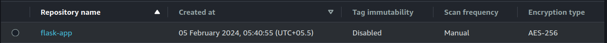
4. Click on the repository name, and on the top right you will be able to see the commands to push your docker image to ECR. Simply run the commands in your terminal.
5. After running the commands, you will be able to see the image pushed to ECR. 
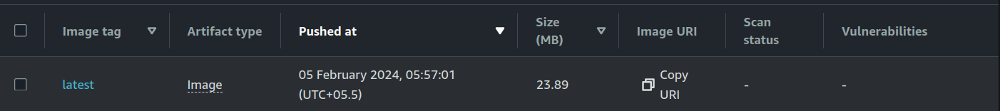


Creating Security Group
---

Before creating the task definition, let's create a security group. \
Since we will be using a load balancer, we need to create a security group for the load balancer.

1. Search for EC2 in the search bar and click on __Security Groups__ (EC2 feature).
2. Click on __Create Security Group__.
3. Enter the name and description of the security group and click on __Create__.
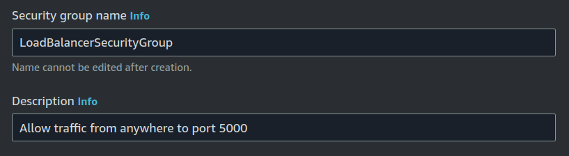
4. Now add __Inbound rules__ to the security group(change the port number according to your requirement).
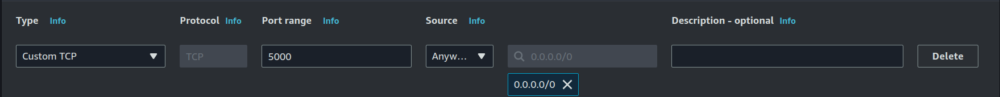
5. Now click on __Create Security Group__.

We will also be requiring a security group for the EC2 instance. You can create a security group for the EC2 instance as follows:
1. Click on __Create Security Group__.
2. Enter the name and description of the security group and click on __Create__.
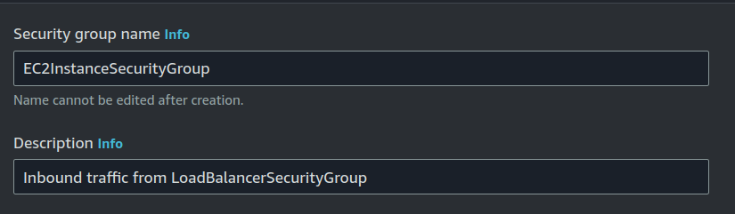
3. Now add __Inbound rules__ to the security group. Note that this time we will be accepting __ALL TCP__ traffic from the security group of the load balancer by selecting __LoadBalancerSecurityGroup__ from the __Source__ dropdown.
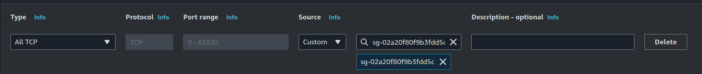
4. Now click on __Create Security Group__.


Creating a new Cluster
---

1. Search for ECS in the search bar and click on __Clusters__.
2. Click on __Create Cluster__.
3. Type the cluster name(eg: flask-app-cluster) and click on __Create__.

You will be able to see the cluster you just created.
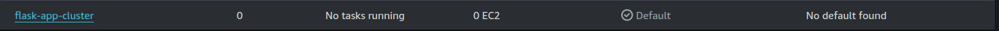

Creating a Task Definition
---

1. Search for ECS in the search bar and click on __Task Definitions__.
2. Click on __Create new Task Definition__.
3. Add a name(eg: flask-task-definition).
4. In the __Infrastructure requirements__ section, select __Task size__ as per your requirement.
5. In the __Container__ section, add the container name(flask-app) and the image URI you pushed to ECR.
6. Click on __Add port mapping__ and add the port number(eg: 5000) and the protocol.
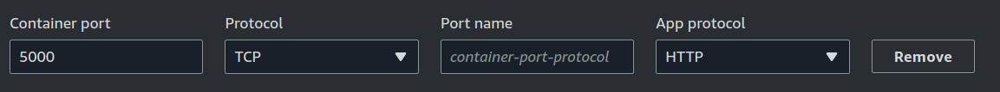
7. Add any environment variables if required.
8. Click on  __Create__.

You will be able to see the task definition you just created.
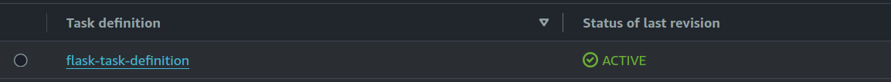

Deploying the Task Definition
---

1. Search for ECS in the search bar and click on __Clusters__.
2. Click on the cluster you created.
3. Click on __Create__.
4. In the __Deployment Configuration__ section, select just created task definition in the __Family__ dropdown.
5. Add __Service name__(eg: flask-app-service).
6. Add the number of tasks you want to run in the __Desired task__(eg: 3).
7. Under __Networking__ section, select __Use an existing security group__ remove the default security group and add the __EC2InstanceSecurityGroup__ you created.
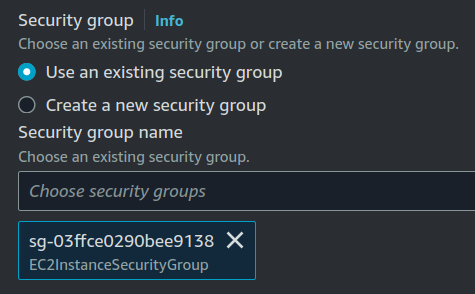
8. Under the __Load balancer__ section, choose __Application Load Balancer__ as the __Load balancer type__. And create a new load balancer using the following details:
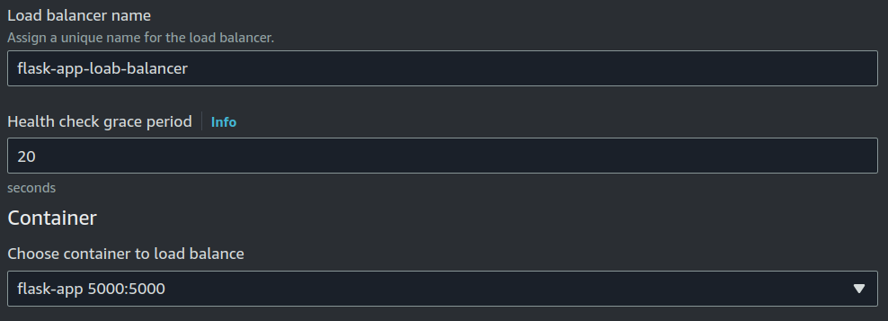
9. Add listeners and target groups as below:
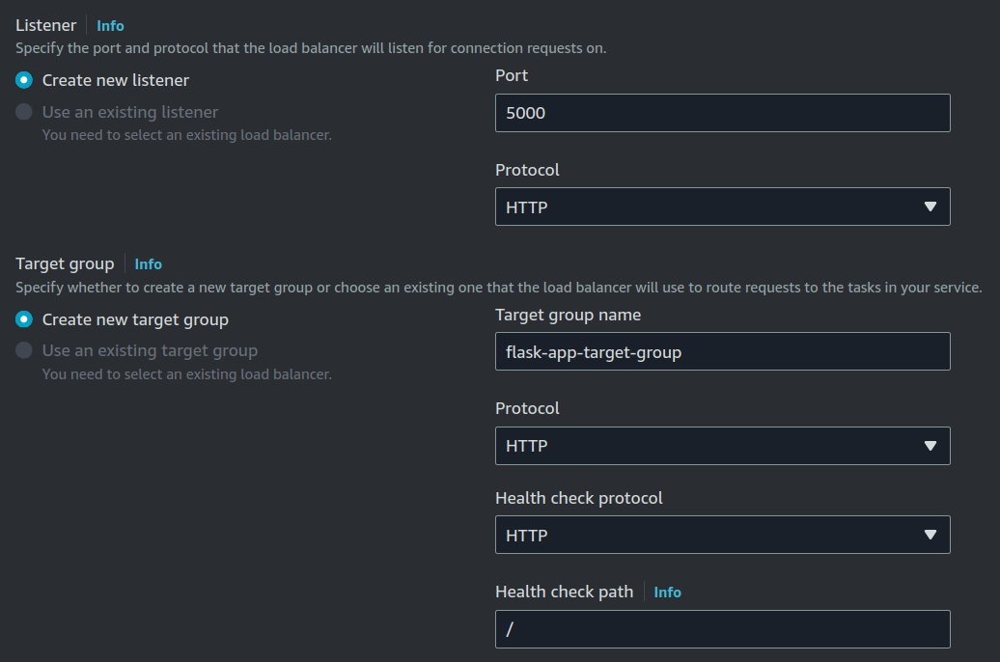
10. Click on __Create__. It may take a few minutes for the service to be deployed.


Setting up security group for the load balancer:
1. Search for EC2 in the search bar and click on __Load Balancers__.
2. Click on the load balancer you just created(eg: flask-app-loab-balancer).
3. Click on the __Security__ tab and click on __Edit__.
4. Remove any default security group and add the __LoadBalancerSecurityGroup__ you created.
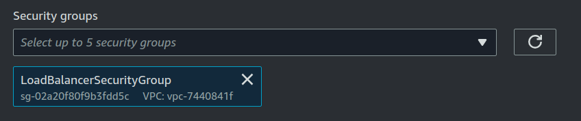

You will be able to see the service you just created.
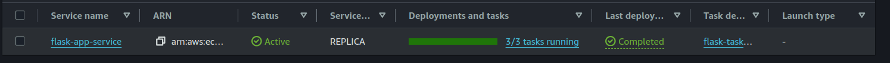

Accessing the application
---

1. Click on the load balancer you created.
2. Copy the __DNS name__ and paste it in your browser(with the port number).
3. You will be able to see the application running.
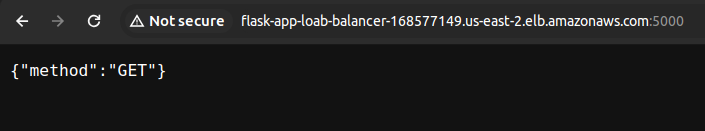


Cleaning up
---

A. Delete the service:
1. Search for ECS in the search bar and click on __Clusters__.
2. Click on the cluster you created.
3. Under the services, select the service you created. And click on __Delete service__.
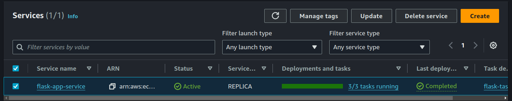

B. Delete the load balancer:
1. Search for EC2 in the search bar and click on __Load Balancers__ in the navigation pane.
2. Select the load balancer you created and click on __Delete__ from __Actions__ dropdown.

C. Delete the task definition:
1. Search for ECS in the search bar and click on __Task Definitions__.
2. Select the task definition you created and click on __Deregister__ from __Actions__ dropdown.

D. Delete the cluster:
1. Search for ECS in the search bar and click on __Clusters__.
2. Select the cluster you created and click on __Delete cluster__.

E. Delete the security groups:
1. Search for EC2 in the search bar and click on __Security Groups__.
2. Select the security groups you created and click on __Delete security group__ from __Actions__ dropdown.

F. Delete the repository:
1. Open the [ECR console](https://us-east-2.console.aws.amazon.com/ecr/home).
2. Select the repository you created and click on __Delete__.

G. Delete the image from ECR:
1. Open the [ECR console](https://us-east-2.console.aws.amazon.com/ecr/home).
2. Select the repository you created and click on __Delete__.

# References
- Deploying public repository to ECS: [Youtube Link](https://www.youtube.com/watch?v=rUgZNXKbsrY)
- Creating IAM User: [Youtube Link](https://youtu.be/vucdm8BWFu0?feature=shared)
- Setting up AWS CLI: [AWS Documentation](https://docs.aws.amazon.com/cli/latest/userguide/getting-started-quickstart.html)